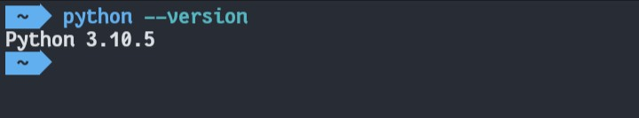

# Printing, Komentar, Konstanta Literal

Halo Class Ini hari pertama kita mulai masuk ke materi koding nya nih. Hari pertama kita akan membahas tentang printing, komentar dan Konstanta literal. Langsung aja ke materi nya ya.

Tapi sebelumnya kalian harus install dulu paket python di termux kalian agar bisa menjalankan kode program python untuk melakukan testing.

Cara install python kalian cukup masukan perintah seperti di bawah ini.

> apt install python -y

Kalian tunggu aja sampe proses instalasi selesai seperti pada gambar di bawah.

   
Sekarang kalian sudah menginstal paket pythok di terminal kalian sekarang untuk uji coba nya kalian ketikan `python --version` untuk melihat versi python yang kalian install.

Di sini python saya install itu versi 3.10.5

Okay jika python sudah di install sekarang kita lanjut materi nya.

Sebelumnya ada sedikit penjelasan mengenai python. Python ini merupakan salah satu pemrogramman dengan jenis bahasa interpreter yang artinya kode python akan dieksekusi baris perbaris. Bila ada kesalahan program di tengah eksekusi, maka program akan berhenti **kecuali** menggunakan penanganan eksepsi.

Jika masih bingung tidak apa-apa nanti seiring jalannya waktu jika sering latihan nanti akan paham.

Oke kita akan mencoba interpreter dari python ini kalian bisa ketik `python` di terminal kalian, maka akan muncul seperti di bawah ini.

Okay sampai sini jangan di close dulu karena kita akan testing kode kita langsung dari interpreter nya python agar kalian paham alur bahasa interpreter itu kayak gimana sih. Sekarang kita mulai masuk materi nya.

## Printing

Singkat nya printing ini adalah cara untuk menampilkan teks pada console terminal kita. Program pertama kita yaitu program yang jika dijalankan akan mengeluarkan hasil teks berupa `Halo Coders!`. Bagaimana caranya?

Kalian hanya perlu menggunakan syntax **print** untuk menampilkan teks, contoh nya seperti pada gambar di bawah kalian ketikan `print('Halo Coders!')` dengan di bungkus kurung kurawal dan single qoute **' '** ataupun double qoute **" "** lalu kalian enter untuk melihat hasilnya.

Maka python akan mengembalikan nilai yang di bungkus dalam `print`. Okay sampai sini kalian sudah bisa menampilkan teks ke console terminal kalian. Kalian bisa coba masukan nama kalian di dalam print untuk melihat hasil nya. Kita lanjut..

## Komentar

Komentar itu apa sih? Komentar adalah syntax yang tidak akan di baca oleh system. Jadi apapun teks yang kalian bungkus dalam komentar dia tidak akan di eksekusi dan di biarkan saja. Gunanya komentar apa? Komentar biasa digunakan programmer untuk memberikan sebuah tanda atau keterangan untuk kode program yang sedang kalian buat, fungsinya untuk memudahkan pembacaan alur proses dari sebuah program.

Dalam python ada dua jenis komentar, yaitu Single Comment dan multi Line Comment.

Beda nya apa? Berikut contoh nya..

### Single Comment

Single Comment di awali dengan tanda pagar `#`

Bisa dilihat pada gambar di atas python tidak mengembalikan nilai apapun karena dia membaca, "Oh ini mah komentar yaudh gak usah di eksekusi". Si python tidak menyampaikan ke system bahwa ada suatu proses yang harus di eksekusi, maka dari itu python tidak akan memberikan nilai apapun karena dia tidak mendapat hasil eksekusi dari system.

### Multi Line Comment

Sebenarnya sama aja hanya dia untuk membungkus beberapa baris teks untuk di jadikan komentar, multiple comment di bungkus dengan 3 single qoute atau double qoute di awal dan 3 single qoute atau double qoute di akhir. Contohnya seperti di gambar.

Kok dia nampil ya? Iya karena penggunaan qoute ini maka python mendaklarasikan bahwa dia ini string, tapi kita bisa manfaatkan ini untuk menjadi multi line comment karena kenapa? Walaupun dia string tapi dia gak punya variabel jadi si python bingung dia di deklarasikan menjadi string tapi gak bisa di proses jadi python akan mengabaikan itu. Tapi tenang aja pada interpreter dia akan nampil tapi setelah kamu buat program di luar console python maka dia tidak akan nampil.

## Konstanta Literal

Singkatnya Konstanta (Constant) itu adalah tipe dari variable yang nilainya tidak dapat diubah. Konstanta ini bakal berguna banget sebagai wadah yang dapat menyimpan informasi yang tidak dapat diubah. Lalu apa itu Literal?

Literal (Literals) itu adalah data mentah (Raw Data) yang diberikan di dalam variabel atau konstanta.

Karena untuk pembahasan ini kalian harus mengenal dengan variabel dulu, maka dari itu materi konstanta dan literal hanya pengenalannya aja nanti akan di bahas lengkap dari di praktekan pada materi variabel.
